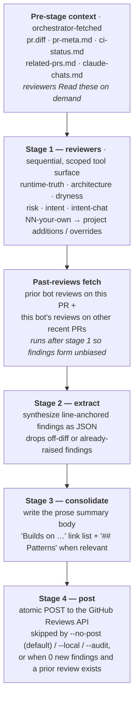

# ai-review

Multi-stage AI pull-request reviewer. Drop a few bash scripts into a
project, and `ai-review` runs them as separate angle-specific reviewers
against the current PR's diff, line-anchors the findings, and produces
one consolidated GitHub review — written as a local preview by default,
or posted straight to the PR with `--push`.

Designed to be:

- **Local.** No CI, no fork attack surface, no secrets in repo. Reviews
  fire from your laptop on demand or via a pre-push hook.
- **Modular.** Each reviewer is its own bash script. Swap, add, delete.
- **Project-aware.** Global defaults inherit into every repo; per-repo
  overrides win when present.
- **Identity-flexible.** Posts under a per-repo GitHub App (one bot per
  project), or falls back to your `gh` login.

Drives the [Claude Code](https://docs.claude.com/en/docs/claude-code/)
CLI under the hood. If you've configured `claude` to talk to a
non-Anthropic backend (Bedrock, Vertex, a custom adapter, etc.),
ai-review uses whatever profile you point it at.

## Install

Requires: `bash`, `git`, `gh`, `jq`, `python3`, `claude` (Claude Code
CLI). For posting reviews under a GitHub App identity, also the Python
`cryptography` package: `python3 -m pip install --user cryptography`.

```bash
git clone https://github.com/vfmatzkin/ai-review ~/Code/ai-review
~/Code/ai-review/install.sh
```

Installs to `~/.local/bin/ai-review` and `~/.local/share/ai-review/`.
Ensure `~/.local/bin` is on your `PATH`.

## First run

In a clone of any repo with an open PR on the current branch:

```bash
ai-review
```

The first time you run it inside a repo, ai-review enters an interactive
setup that walks through:

1. **Claude profile** — which `CLAUDE_CONFIG_DIR` to use for this repo
2. **Identity** — post under a GitHub App, your `gh` login, or auto
3. **Reviewers** — copy global defaults into `<repo>/.ai-review/reviewers/`
   for project-specific tweaking, or run with the globals as-is
4. **Hook hint** — a pre-push lefthook stanza you can paste in

Every subsequent invocation skips setup and runs the pipeline. By
default a run writes a local **preview** to `<repo>/.ai-review/reviews/`;
add `--push` to post it straight to the PR, or run `--post` later to
publish a preview you've already generated.

To re-enter the wizard later: `ai-review --init`.

## How it works



Why multi-stage rather than one shot:

- **Sharper output.** Each stage-1 reviewer has a single focus; stage 2
  does the meta-synthesis. The model performs better with one job at a
  time.
- **Validated lines.** Stage 2's findings are checked against the
  actual diff hunks before being posted. The model can't hallucinate
  line numbers that don't exist.
- **Atomic post.** One Reviews API call, all comments together. No
  half-posted reviews on failure.
- **Memory across runs.** A re-review on the same PR fetches prior bot
  reviews (including Copilot, since it's tagged as a bot) and dedupes.
  No more posting near-identical reviews back-to-back; new reviews
  open with "Builds on [prior review](URL). New this round: …" and
  focus on what changed since.

## Commands

| Command | Purpose |
|---|---|
| `ai-review` | Run the PR-review pipeline. First time in a repo → wizard. Writes a local preview by default. |
| `ai-review --push` | Post the review straight to the PR instead of writing a preview. |
| `ai-review --no-post` | Force preview-only (the default): write to `<repo>/.ai-review/reviews/`, don't post. |
| `ai-review --post` | Post the most recent preview for this repo (after a `--no-post` run). |
| `ai-review --pr N` | Review PR number N instead of the current branch's PR. |
| `ai-review --local` | Review the local diff with no PR → local report. |
| `ai-review --no-resume` | Start fresh instead of resuming an interrupted run for the same PR + HEAD. |
| `ai-review --guidance FILE` | Append FILE to every reviewer's system prompt (project/PR-specific context). |
| `ai-review --audit` | Whole-repo audit → markdown report at `<repo>/.ai-review/audits/`. |
| `ai-review --init` | Re-enter the wizard. |
| `ai-review --list` | Show discovered reviewers (project + global). |
| `ai-review --status` | Run table — running runs + anything from the last 30 minutes. |
| `ai-review --status latest` | Most recent run per repo. |
| `ai-review --status N` | Last N runs per repo. |
| `ai-review --status pending` | Unposted previews awaiting `--post`. |
| `ai-review --status all` | Every recorded run. |
| `ai-review --include foo,bar` | Force-include reviewers `foo` and `bar`. |
| `ai-review --exclude runtime-test` | Skip a reviewer. |
| `ai-review --only correctness` | Run ONLY this one (overrides everything else). |
| `ai-review --quick` | Skip stages 2-3, post a single concatenated comment. |
| `ai-review --keep` | Preserve `/tmp/ai-review/<run>` after the run. |

## Reviewers

Discovery order, by basename:

```text
<repo>/.ai-review/reviewers/*.sh         # project-specific (overrides)
~/.local/share/ai-review/reviewers.default/*.sh   # globals
```

The included global defaults — six complementary angles, no overlap
by design (test-coverage gaps fold into each angle's own focus area
rather than living in a separate `tests` reviewer):

| Reviewer | Focus | Applies when |
|---|---|---|
| `01-runtime-truth.sh` | empirical: build + test (auto-detected for Cargo / npm / pytest / make) AND GitHub Actions CI parity | non-empty diff |
| `02-architecture.sh` | dependency direction, layer/module boundaries, port/adapter discipline, public-API surface | diff touches a code file |
| `03-dryness.sh` | DRY violations across files, dead code, rewrite cycles via code_archaeology | diff touches a code file |
| `04-risk.sh` | adversarial: failure modes (races, cleanup, cancellation, panic safety) + security (injection, secrets, traversal) | any non-empty diff |
| `05-intent.sh` | diff vs PR description vs project docs (AGENTS.md / CONTRIBUTING / specs); cross-PR drift via `related-prs.md` | any non-empty diff |
| `06-intent-chat.sh` | build intent: diff vs what you actually asked for in the Claude Code session that produced it, via `claude-chats.md` | non-empty diff AND a chat digest was found |

Defaults are **language-agnostic, Python-first** — they recognize
Python (`pyproject.toml` + pytest) out of the box and have concrete
Python idioms in their prompts (asyncio races, bare `except:`,
`__del__` quirks, etc.). For Rust / Go / TS projects you'll usually
want a project override at `<repo>/.ai-review/reviewers/NN-*.sh` that
names the precise crate / package layout invariants.

The code-file regex covers common-case languages out of the box —
narrow it in your project override if you want a tighter filter.

To customize, copy them into your project (`ai-review --init` does this
automatically) and tweak the prompts. Each copy gets a header explaining
what to tailor.

To write your own from scratch, see
[docs/writing-reviewers.md](docs/writing-reviewers.md).

## Configuration

Two config layers, plus inline env-var override:

```text
inline env  >  <repo>/.ai-review/config  >  ~/.config/ai-review/config
```

Project config uses plain `KEY=value` assignment so it overrides global.
For a one-shot env override, set the var on the same command line:
`AI_REVIEW_IDENTITY=gh-user ai-review`. (Env vars set in your shell rc
will be clobbered by config files — that's intentional, so you don't
get surprises from stale shell state.)

Knobs:

| Variable | Purpose | Default |
|---|---|---|
| `AI_PROFILE_DIR` | `CLAUDE_CONFIG_DIR` for this run | `~/.claude` |
| `AI_CMD` | Logical label (shown in logs / status) | `default` |
| `AI_MODEL` | Model override for the reviewers | (none — let Claude pick) |
| `AI_MODEL_STAGE2` | Model override for the stage-2 extract (mechanical JSON) | (none — use `AI_MODEL`) |
| `AI_MODEL_STAGE3` | Model override for the stage-3 summary | (none — use `AI_MODEL`) |
| `AI_TIMEOUT` | Per-reviewer timeout in seconds | `600` |
| `AI_PRELAUNCH` | Shell command run before the first reviewer | (none) |
| `AI_REVIEW_IDENTITY` | `auto` / `app` / `gh-user` | `auto` |

See [`examples/config.example`](examples/config.example).

## Identity / posting as a bot

ai-review can post under a per-repo GitHub App so reviews come from a
named bot account (`my-review-bot[bot]`) rather than your personal
identity. App config lives at:

```text
~/.config/ai-review/apps/<owner>__<repo>.{conf,pem}
```

When `AI_REVIEW_IDENTITY=auto` (default), the App is used if the conf
exists for the current repo, otherwise `gh` user login. Walkthrough at
[docs/github-app-setup.md](docs/github-app-setup.md).

## Recommended companion MCP servers

The shipped `STAGE1_TOOLS` allowlist (in `share/lib/common.sh`) includes
references to a handful of MCP servers. If you don't have them installed,
those tool names simply won't be reachable to the reviewer — no error,
just less rich research. The orchestrator works fine without any of them.

If you want the reviewers' research depth to match what they were
designed for, install:

| MCP server | What it adds | Repo |
|---|---|---|
| `claude-review-mcp` | `audit_pr`, `research_project`, `find_examples_of`, `read_with_question`, `code_archaeology`, `compare_files` — focused review/research tools each in an isolated subprocess | <https://github.com/vfmatzkin/claude-review> |
| `brave-search` | Web search inside the reviewer (useful for "is this CVE still live", library version checks) | community MCP |
| `context7` | Live library documentation lookups (better than relying on training-data knowledge of API surfaces) | community MCP |

The defaults run with just `Read Glob Grep` (built-in to `claude`) when
the MCPs aren't present.

## Multi-profile setups

Different repos can drive different Claude profiles — useful when work
and personal accounts are separate, when one repo uses Bedrock and
another uses Anthropic API, or when you've wired `claude` up to a
non-Anthropic adapter for some projects but not others.

A worked example using the maintainer's setup is at
[docs/multi-profile-setup.md](docs/multi-profile-setup.md).

## Pre-push hook (optional)

If you use [lefthook](https://github.com/evilmartians/lefthook), drop
this into your `lefthook-local.yml` (or repo-shared `lefthook.yml`):

```yaml
pre-push:
  commands:
    ai-review:
      run: |
        if [ "${AI_REVIEW:-}" = "1" ]; then
          mkdir -p "$HOME/.cache"
          ( sleep 8 && ai-review </dev/null >>"$HOME/.cache/ai-review.log" 2>&1 ) &
          disown 2>/dev/null || true
          echo "▸ ai-review running in background"
        else
          echo "▸ skipping ai-review (set AI_REVIEW=1 to enable)"
        fi
```

Then `AI_REVIEW=1 git push` fires a review on the just-pushed commit;
plain `git push` skips it.

## Status

```text
$ ai-review --status
REPO                          PR  STATUS      STARTED            TOTAL  LINK
----------------------------------------------------------------------------
acme/api                      42  done        2026-05-04 11:04    2m57  https://github.com/acme/api/pull/42#pullrequestreview-...
    ↳ correctness               54s   2K  ✓
    ↳ security                  41s   1K  ✓
    ↳ stage2-extract           1m05  673B  ✓
    ↳ stage3-summary            49s   4K  ✓
acme/api                      41  done        2026-05-04 10:17    2m08  https://github.com/acme/api/pull/41#pullrequestreview-...
acme/web                      12  running     2026-05-04 11:08      …   https://github.com/acme/web/pull/12
    ↳ tests                      …        running
```

Per-task lines show name, elapsed, output bytes, and an exit-code mark.
The LINK column shows the actual review URL once the post stage records
it; in-flight or skipped runs fall back to the bare PR URL.

State files live in `~/.local/state/ai-review/runs/`. Each run produces
a `.run` (key=value metadata) and a `.tasks` (one line per `call_claude`
invocation: `name|start|end|exit|bytes`).

## Whole-repo audit (`--audit`)

`ai-review --audit` runs every discovered reviewer against the working
tree (not a diff) and writes a single markdown report to
`<repo>/.ai-review/audits/YYYY-MM-DD-HHMM.md`. No GitHub interaction —
the file is the deliverable.

Mode differences from PR mode:

- No diff. Reviewers receive `AI_REVIEW_MODE=audit`; `stage1_header`
  switches to a "walk the working tree" preamble.
- All reviewers run unconditionally (`applies()` is skipped — no diff
  to filter against).
- No stage 2 / 3 / 4. Stage-1 outputs are concatenated into the report
  with one section per reviewer.
- Run shows up in `--status` as `PR=audit`, with the report path as
  the `LINK` column.

The included `.gitignore` excludes `.ai-review/audits/` by default —
audits are private working notes, not committed source. Comment the
rule out if you want them tracked.

## License

MIT. See [LICENSE](LICENSE).
